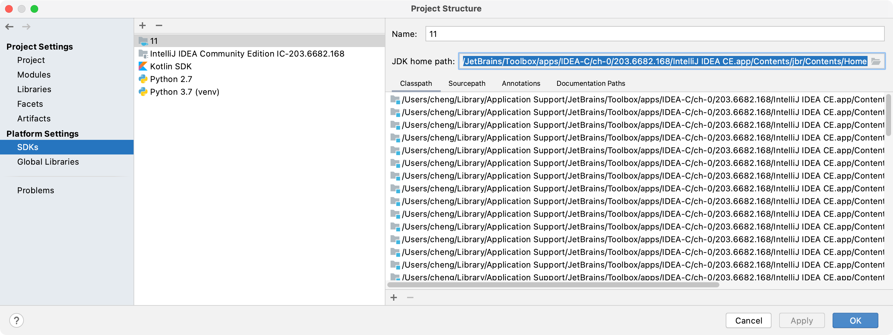

# Serenade for IntelliJ


[](https://plugins.jetbrains.com/plugin/PLUGIN_ID)
[](https://plugins.jetbrains.com/plugin/PLUGIN_ID)

## Template ToDo list
- [x] Create a new [IntelliJ Platform Plugin Template][template] project.
- [x] Verify the [pluginGroup](/gradle.properties), [plugin ID](/src/main/resources/META-INF/plugin.xml) and [sources package](/src/main/kotlin).
- [x] Review the [Legal Agreements](https://plugins.jetbrains.com/docs/marketplace/legal-agreements.html).
- [ ] [Publish a plugin manually](https://www.jetbrains.org/intellij/sdk/docs/basics/getting_started/publishing_plugin.html) for the first time.
- [ ] Set the Plugin ID in the above README badges.
- [ ] Set the [Deployment Token](https://plugins.jetbrains.com/docs/marketplace/plugin-upload.html).

<!-- Plugin description -->
Serenade for IntelliJ includes editor support and tab management.
<!-- Plugin description end -->

## Prerequisites

1. IntelliJ IDEA 2020.3.1 (latest)
1. 
    ```
    brew install ktlint
    ktlint installGitPreCommitHook
    ```

## Development

1. In IntelliJ IDEA, add the Plugin SDK: https://jetbrains.org/intellij/sdk/docs/basics/getting_started/setting_up_environment.html
1. In File > Project Structure ... be sure that the right JDKs are selected, from the installed IntelliJ IDEA, and selected everywhere:

   

   

   

   

1. `ktlint -F "**/*.kt*"` should find and fix any lint issues.

## Manual build

1. Update the version number in `gradle.properties`.
1. Add version to `CHANGELOG.md`.
1. `./gradlew build` should create a `build/distributions/serenade-x.x.x.zip` that contains all the dependencies.

## Auto-build

1. Every time a valid commit is pushed, a GitHub Actions runs: https://github.com/serenadeai/intellij/actions
2. The most recent successful run (with a green checkmark) will have a `plugin-artifact` under the build section. Download and run `unzip plugin-artifact.zip` to get a `serenade-x.x.x.zip` that should be identical to a manual build.

## Installation

1. In an IntelliJ IDE, go to Preferences > Plugins > (gear icon) > Install Plugin from Disk ... and select `serenade-x.x.x.zip`. `plugin-artifact.zip` will _not_ work unless it's unzipped once first.
2. Then click Apply. The IDE will reload everything, and a Serenade tab should appear on the right side in the editor window.
